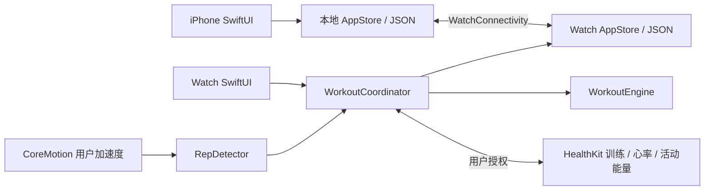

# 架构、数据与技术边界

版本基线：Swift 5 语言模式、SwiftUI、iOS 17+、watchOS 10+。工程配置以 `project.yml` 为源，`RepFlow.xcodeproj` 为生成产物。无服务端、用户账号、第三方分析 SDK 或订阅系统。

## 模块与职责

| 模块 | 职责 |
| --- | --- |
| `RepFlowCore` Swift Package | Codable 数据模型、训练状态机、规则计划生成、动作计次算法，可在 Linux 上测试 |
| `Shared/AppStore.swift` | 本地 JSON 读写、计划／历史变更、导出、训练草稿 |
| `Shared/ConnectivityService.swift` | WatchConnectivity 配对同步、消息投递与可用性状态 |
| `WatchApp` | 独立手表界面、训练协调、CoreMotion 采样、HealthKit 训练 |
| `PhoneApp` | 大屏编辑计划、模板编排、历史详情、设置与 JSON 导出 |

`WorkoutEngine` 与 `RepDetector` 没有 HealthKit / SwiftUI 依赖。界面、传感器权限与系统会话由 Apple 平台层管理；因此核心测试通过不代表平台 API 接线正确。

## 训练状态与数据语义

训练阶段为 ready、active、resting、paused、finished。开始本组、确认完成一组、跳过休息、切换动作和结束均为明确操作。休息到期不会启动下一组，达到组数目标不会自动跳到下一个动作。

`CompletedSet` 保留动作 ID、当时的动作名称、实际次数、重量、完成时间及是否使用辅助模式。训练历史使用训练时的快照，后续改名不会改写过去。完成度先对每个动作的已完成组数按该动作目标封顶，再求和除以计划总组数，限制在 0…1；多做某个动作不能抵扣跳过其他动作，也不是按负重或动作质量评估的达标率。

组内显示次数与「已确认组」分开保存。直接结束或切换动作会丢弃尚未确认的这一组，界面需确认。结束操作使用稳定的记录 ID，重复触发不应生成重复历史。

草稿用于异常退出后恢复；恢复时必须暂停、关闭动作传感器，等待用户继续。草稿恢复不能续接已经丢失的系统 HealthKit 会话。

## 辅助计次

数据源为 `CMDeviceMotion.userAcceleration`，即移除重力后的三轴加速度，单位 g。手表只在 active 阶段且动作开启 assisted 模式时，以约 50 Hz 请求更新。实际采样节奏仍受系统调度影响。

检测器依据动作轨迹参数对周期信号做滤波、阈值与滞回判断，并限制单次周期时长及相邻触发间隔。检测完整周期才报告一次计次；开始新组时重置检测状态，避免把上组运动拼接到下组。源码是可调试的规则算法，不包含训练好的机器学习模型。

同一算法轨迹用于宽／窄高位下拉、宽／窄坐姿划船；区别体现在动作名称和计划，不能宣称系统识别握距。下肢运动、固定手腕或非常缓慢的动作尤其不可靠。深蹲默认手动，辅助模式需主动开启。

已覆盖的程序验证是合成信号、静止／噪声及时间边界。合成正弦或周期信号不是人体动作测评。发布前需要真实设备、不同用户和真实器械的测量；未完成测量前不得使用「精准」「识别所有动作」等宣传。

## HealthKit 与 CoreMotion

Watch target 使用 HealthKit capability、读取／写入目的说明和 `workout-processing` 后台模式。力量训练会话负责系统训练生命周期；用户明确结束时才尝试保存 HealthKit 训练。训练记录需优先保存至本地，健康保存失败不能导致本地训练丢失。

HealthKit 授权成功回调不代表用户同意了全部读取项；系统保护读取权限状态，App 可能仅收到空数据。写入权限和读取权限分别处理，界面应允许部分数据缺失。拒绝权限或启动失败仍提供手动记录。

心率与能量由 Apple Watch / HealthKit 提供，不由腕部计次算法推算。平均心率是本次收到的测量数据的汇总值，不保证覆盖完整训练，也不代表医疗级测量。

CoreMotion 在暂停、休息、完成或错误清理后停止。HealthKit 会话在正常休息阶段仍可继续记录整场训练；这和只在本组运动时启用的计次传感器不同。没有有效健康会话时，App 进入后台会主动暂停本组；仅本地模式必须保持 App 前台，不能承诺熄屏持续计次。

## 保存与同步

计划、历史和草稿为本地 JSON。保存失败应显示错误，不能把解码失败当成「首次安装」而覆盖原文件。导出仅由用户触发，首版不实现导入。

计划同步使用项目更新时间合并，并保存删除标记，避免旧设备的计划重新出现。计划和记录的删除会同步至配对设备。清空操作使用 reset 时间戳，清除两端此前的计划和历史，后续新建内容保留；本机草稿也会被清除，不影响用户另存的导出文件或健康 App 数据。对同一个计划两端同时编辑时，是以更新时间作整体取舍，不是逐字段合并；设备时钟不一致时要人工确认最终内容。

训练记录以 UUID 去重，使用 WatchConnectivity 的持久化投递及适当的上下文快照。传输由系统排队，不承诺即时到达。App 不自行访问开发者服务器，不经由开发者账户处理健康数据。用户主动分享的 JSON 与系统健康数据存储另行受用户的分享选择和 Apple 系统设置管理。

`scripts/test-sync.sh` 使用 Combine／传输的测试替身运行实际存储代码，覆盖合并、删除标记、去重、草稿、清空与损坏文件等场景。这验证应用侧状态逻辑，不替代 WCSession 实际投递、配对状态与系统后台调度的真机检查。

删除、清空、重新安装及离线后重连的行为应以[真机清单](DEVICE_TEST_PLAN.md)实测。不要把 JSON 导出称为已有自动恢复的备份服务，也不要把配对同步称为多设备云同步。

## 发布前仍需完成

- Mac 上对两个 target 进行真实 SDK 编译，处理当前 Xcode 的编译／并发诊断。
- 验证签名、HealthKit entitlements、独立安装、WatchConnectivity 和后台训练。
- 在真实动作与器械上测量计次误差，依据证据调整默认参数和可支持的动作范围。
- 核对最小表盘、动态字体、VoiceOver、低电量、来电中断、权限拒绝和存储错误。
- 填写真实运营主体、支持与隐私页面，使用正式图标和真实截图完成 TestFlight 与审核。

当前源码包含上述能力的实现与核心测试，不包含这些平台验收已完成的证明。
